# Woche 1

### Tag 1 + 2

```mermaid
gantt
	dateFormat HH:mm
	axisFormat %e.%m. %H:%M
	tickinterval 12hour
	section G.O.R.N
		Abreise in Niewinter: milestone, done, a1, 2024-04-23 08:00, 30m
		Reise auf der Hohen Straße: done, a2, after a1, 2d
```

>

### Tag 3

```mermaid
gantt
	dateFormat HH:mm
	axisFormat %e.%m. %H:%M
	tickinterval 1hour
	weekday thursday
	section G.O.R.N
		Auf den Dreieberpfad: done, a1, 2024-04-25 07:00, 2h
		Goblinüberfall: done, milestone, a2, after a1, 30m
		Cragmaw Versteck: done, a3, after a2, 5h
		Weiterreise auf dem Dreieberpfad: done, a4, after a3, 3h
		Herberge an der Weggabelung: done, milestone, a5, after a4, 30m
		Weiterreise nach Phandalin: done, a6, after a5, 2h
```

>

### Tag 4

```mermaid
gantt
	dateFormat HH:mm
	axisFormat %e.%m. %H:%M
	tickinterval 1hour
	weekday friday
	section G.O.R.N
		Weiterreise nach Phandalin: done, a1, 2024-04-26 07:00, 1.5h
		Ankunft in Phandalin: done, milestone, a2, after a1, 30m
		Geschäfte in Phandalin: done, a3, after a2, 6h
		Rotbrenner aufgemischt: done, milestone, a4, after a3, 30m
		Lange Rast: done, a5, after a4, 8h
```

>

### Tag 5

```mermaid
gantt
	dateFormat HH:mm
	axisFormat %e.%m. %H:%M
	tickinterval 1hour
	weekday saturday
	section G.O.R.N
		Überfall auf das Gasthaus: done, milestone, a1, 2024-04-27 02:00, 30m
		Tresendar Anwesen: done, a2, after a1, 5h
		Lange Rast: done, a3, after a2, 8h
		Treffen mit Sildar: done, a4, after a3, 30m
		Reise zum Haderhügel: done, a5, after a4, 2.5h
		Kampf mit den Mantikoren: done, milestone, a6, after a5, 30m
		Kurze Rast: done, a7, after a6, 1h
		Reise zur Zwergenausgrabung (halber Weg): done, a8, after a7, 4h
```

>

### Tag 6

```mermaid
gantt
	dateFormat HH:mm
	axisFormat %e.%m. %H:%M
	tickinterval 1hour
	weekday sunday
	section G.O.R.N
		Lager aufgeschlagen: done, milestone, a1, 2024-04-28 00:00, 15m
		Lange Rast: done, a2, after a1, 8h
		Lager abgebaut & frühstücken: done, milestone, a3, after a2, 30m
		Weiterreise zur Zwergenausgrabung: done, a4, after a3, 2h
		Tempel des bösen Zwergengottes (Zwergenausgrabung) erreicht: done, milestone, a5, after a4, 0m
		Tempel erkunden: done, a6, after a5, 15m
		Kampf mit Schleim-Monstern: done, milestone, a7, after a6, 20m
		Altar untersuchen, Geheimgang gefunden: done, a8, after a7, 30m
		Verschütteter Durchgang freilegen: done, a9, after a8, 3h
		Weiter graben (Wahnsinn breitet sich aus): done, a10, after a9, 1h
		Aranon löst Falle aus: done, milestone, a11, after a10, 10m
		Raum mit zerstörten Statuen untersuchen: done, a12, after a11, 30m
		Altarraum nochmal untersuchen: done, a13, after a12, 2h
		GORN verlässt verfluchten Tempel: milestone, a14, after a13, 0m
		Ork Überfall/Angriff: milestone, a15, after a14, 15m		
		Jon Longbow wurde getötet: milestone, a16, after a15, 10m
		Gruppe hat sich veraztet und die Orks gelootet/verbrannt: done, a17, after a16, 30m
		Tote Mienenarbeiter Zwerge begraben: done, a18, after a17, 2h
		Lange Rast: done, a19, after a18, 3h
```

### Tag 7

```mermaid
gantt
	dateFormat HH:mm
	axisFormat %e.%m. %H:%M
	tickinterval 1hour
	weekday monday
	section G.O.R.N
		Lange Rast: a1, 2024-04-29 00:00, 9h 
		Rückreise nach Phandalin: done, a2, after a1, 9h
		Ankunft in Phandalin: done, milestone, a3, after a2, 0h
		Belohnungen von Sildar kassiert: done, milestone, a4, after a3, 30m
		Lucian lernt Ar'go in einer Kneipe kennen & tritt G.O.R.N bei: done, milestone, a5, after a3, 30m
		Ein Bote/Späher erreicht Phandalin: done, milestone, a6, after a5, 20m
```

- Shoppen
- Jon Begräbnis
- Party (paar Stunden)
Tag 8
-  Kurze/Lange Rast (bis 7 Uhr) (nächster Tag)
- Reise zur Herberge (dauer: 4h)
- Herberge untersuchen
- Weiterreise (bis kurz vor Nachtlager aufgeschlagen wird)
- Gekreuzigter Mensch gefunden (Glassstab)
- Lange Rast
Tag 9
- bis  (7 Uhr)
- Weiterreise bis Abends (8h max)
- Lange Rast
Tag 10
- bis (7 Uhr)
- Weiterreise zur Hasenbeere
- 3x Pferde überredet mit zu kommen
- Weiterreise nach Butterschädelhof (noch nicht angekommen)
- Kuh getroffen
- Ankunft an Butterschädelhof

> Hier befinden wir uns aktuell!

# Woche 2

### Tag 8

>
### Tag 9

>

### Tag 10

>

### Tag 11

>

### Tag 12

```mermaid
gantt
	dateFormat HH:mm
	axisFormat %e.%m. %H:%M
	tickinterval 1hour
	weekday saturday
	section G.O.R.N
		-: a1, 2024-05-04 00:00, 
```

>

### Tag 13

>

### Tag 14

# Woche 3
