### Tag 1 + 2

```mermaid
gantt
	dateFormat HH:mm
	axisFormat %e.%m. %H:%M
	tickinterval 12hour
	section G.O.R.N
		Abreise in Niewinter: milestone, done, a1, 2024-04-23 08:00, 30m
		Reise auf der Hohen Straße: done, a2, after a1, 2d
```


### Tag 3

```mermaid
gantt
	dateFormat HH:mm
	axisFormat %e.%m. %H:%M
	tickinterval 1hour
	weekday thursday
	section G.O.R.N
		Auf den Dreieberpfad: done, a1, 2024-04-25 07:00, 2h
		Goblinüberfall: done, milestone, a2, after a1, 30m
		Cragmaw Versteck: done, a3, after a2, 5h
		Weiterreise auf dem Dreieberpfad: done, a4, after a3, 3h
		Herberge an der Weggabelung: done, milestone, a5, after a4, 30m
		Weiterreise nach Phandalin: done, a6, after a5, 2h
```


### Tag 4

```mermaid
gantt
	dateFormat HH:mm
	axisFormat %e.%m. %H:%M
	tickinterval 1hour
	weekday friday
	section G.O.R.N
		Weiterreise nach Phandalin: done, a1, 2024-04-26 07:00, 1.5h
		Ankunft in Phandalin: done, milestone, a2, after a1, 30m
		Geschäfte in Phandalin: done, a3, after a2, 6h
		Rotbrenner aufgemischt: done, milestone, a4, after a3, 30m
		Lange Rast: done, a5, after a4, 8h
```


### Tag 5
```mermaid
gantt
	dateFormat HH:mm
	axisFormat %e.%m. %H:%M
	tickinterval 1hour
	weekday thursday
	section G.O.R.N
		Überfall auf das Gasthaus: done, milestone, a1, 2024-04-27 02:00, 30m
		Tresendar Anwesen: done, a2, after a1, 5h
		Lange Rast: done, a3, after a2, 8h
		Treffen mit Sildar: done, a4, after a3, 30m
		Reise zum Haderhügel: done, a5, after a4, 2.5h
		Kampf mit den Mantikoren: done, milestone, a6, after a5, 30m
		Kurze Rast: 
```