# Woche 1

### Tag 1 + 2

>

### Tag 3

>

### Tag 4

>

### Tag 5

>

### Tag 6

>

### Tag 7

```mermaid
gantt
	dateFormat HH:mm
	axisFormat %e.%m. %H:%M
	tickinterval 1hour
	weekday monday
	section G.O.R.N
		Lange Rast: a1, 2024-04-29 00:00, 9h 
		Rückreise nach Phandalin: done, a2, after a1, 9h
		Ankunft in Phandalin: done, milestone, a3, after a2, 0h
		Belohnungen von Sildar kassiert: done, milestone, a4, after a3, 30m
		Lucian lernt Ar'go in einer Kneipe kennen & tritt G.O.R.N bei: done, milestone, a5, after a3, 30m
		Ein Bote/Späher erreicht Phandalin: done, milestone, a6, after a5, 20m
		Gruppe stockt Vorräte auf: done, a7, after a6, 1h
		Jon bekommt ein Feuerbegräbnis: done, milestone, a8, after a7, 1h
		After-Party: done, a9, after a8, 190m
```

# Woche 2

### Tag 8

```mermaid
gantt
	dateFormat HH:mm
	axisFormat %e.%m. %H:%M
	tickinterval 1hour
	weekday tuesday
	section G.O.R.N
		After-Party: a1, 2024-04-30 00:00, 4h
		Schlafen (Kurze/Lange Rast): done, a2, after a1, 3h
		Reise zur Herberge: done, a3, after a2, 4h
		Herberge nochmal untersuchen: done, milestone, a4, after a3, 30m
		Weiterreise (Richtung "Hasenbeere"): done, a5, after a4, 10h
		Gekreuzigten und gefolteter Mensch an Weggabelung gefunden (Böser Magier "Glasstab"): done, milestone, a6, after a5, 30m
		Schlafen (Lange Rast): done, a7, after a6, 2h
```

>
### Tag 9

```mermaid
gantt
	dateFormat HH:mm
	axisFormat %e.%m. %H:%M
	tickinterval 1hour
	weekday wednesday
	section G.O.R.N
		Schlafen (Lange Rast): a1, 2024-05-01 00:00, 7h
		Weiterreise (Richtung "Hasenbeere"): done, a2, after a1, 12h
		Schlafen (Lange Rast): done, a3, after a2, 5h
```

>

### Tag 10

```mermaid
gantt
	dateFormat HH:mm
	axisFormat %e.%m. %H:%M
	tickinterval 1hour
	weekday thursday
	section G.O.R.N
		Schlafen (Lange Rast): a1, 2024-05-02 00:00, 7h
		Weiterreise (Richtung "Hasenbeere"): done, a2, after a1, 4h
		Ankunft "Hasenbeere": done, milestone, a3, after a2, 0m
		Unterhaltung mit 3 markierten Pferde: done, a4, after a3, 15m
		Weiterreise (Richtung "Butterschädelhof"): done, a5, after a4, 3h
		Ankunft "Butterschädelhof": done, milestone, a6, after a5, 0m
		Erkundung & Schleichen: done, a7, after a6, 30m
		Niptac befreit "Big Al": done, a8, after a7, 45m
		Weißer erwachsener Drache überfällt den "Butterschädelhof": done, milestone, a9, after a8, 30m
		Weißer erwachsener Drache tötet alle Orks und fliegt mit 2 Kühen weg: done, a10, after a9, 30m
		GORN untersucht die toten Orks & stimmen sich ab: done, milestone, a11, after a10, 1h
		GORN bringt die Kuh "Betunia" zurück: done, a12, after a11, 2h
		GORN reist wieder nach Phandalin zurück: done, a13, after a12, 270m
```

>

### Tag 11

>

### Tag 12

>

### Tag 13

```mermaid
gantt
	dateFormat HH:mm
	axisFormat %e.%m. %H:%M
	tickinterval 1hour
	weekday sunday
	section G.O.R.N
		Ankunft in Phandalin: a1, 2024-05-05 00:00, 15h
		Zildar über den Butterschädelhof und den Weißen Drachen berichtet: done, milestone, a2, after a1, 30m
		GORN geht mit Zildar saufen: done, a3, after a2, 2h
		GORN bricht zur Hasenbeere mit der Holzlieferung auf: done, a4, after a3, 7h
```

>

### Tag 14

```mermaid
gantt
	dateFormat HH:mm
	axisFormat %e.%m. %H:%M
	tickinterval 1hour
	weekday monday
	section G.O.R.N
		Reisen - Schlafen (Lange Rast): a1, 2024-05-06 00:00, 24h
```

# Woche 3

### Tag 15

```mermaid
gantt
	dateFormat HH:mm
	axisFormat %e.%m. %H:%M
	tickinterval 1hour
	weekday monday
	section G.O.R.N
		Reisen - Schlafen (Lange Rast): a1, 2024-05-07 00:00, 24h
```

>

### Tag 16

```mermaid
gantt
	dateFormat HH:mm
	axisFormat %e.%m. %H:%M
	tickinterval 1hour
	weekday monday
	section G.O.R.N
		Ankunft in Hasenbeere mit der Holzlieferung: done, a1, 2024-05-08 00:00, 9h
```

> Hier befinden wir uns aktuell!

### Tag 17

>

### Tag 18

>

### Tag 19

>

### Tag 20

>

### Tag 21

>
